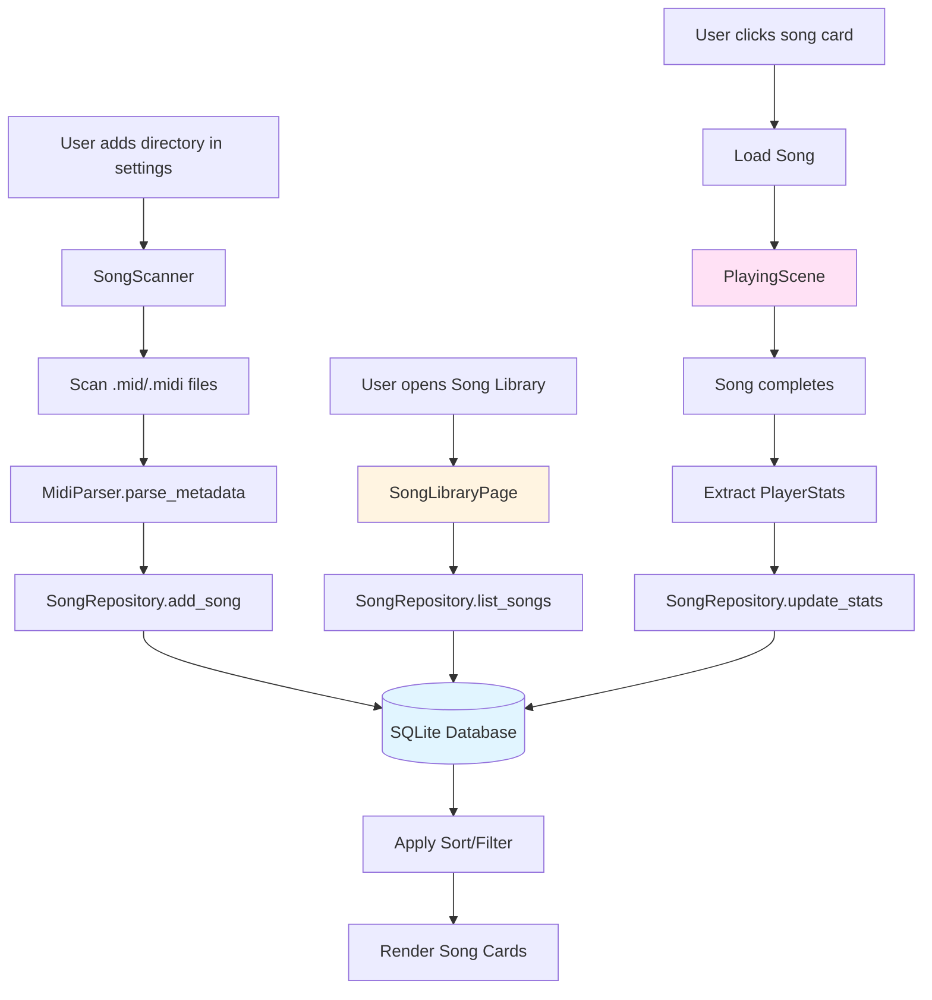

# Task 10: Song Library Feature

## Description

This task involves implementing a comprehensive Song Library system that allows users to browse, manage, and track their MIDI song collection. The feature provides a responsive UI displaying songs as interactive cards with metadata, robust sorting and filtering capabilities, and persistent storage of song information and user statistics.

Currently, users can only open MIDI files through a file picker dialog, with no way to browse their collection or track play history and statistics.

### Objective

Create a full-featured Song Library that enables users to:
1. Browse their MIDI song collection in a visual, card-based interface
2. Sort and filter songs by various criteria (name, difficulty, play count, last score)
3. Manage song directories through settings (add/remove folders)
4. Track persistent statistics (play count, last score, last played date)
5. Quickly load and play songs from the library

## Actionable Checklist

### Phase 1: Database and Storage Layer

- [ ] **1.1 Select and Integrate Database**
  - Choose SQLite with `rusqlite` crate (justification: mature, embedded, excellent query capabilities)
  - Add `rusqlite` dependency to [`neothesia/Cargo.toml`](neothesia/Cargo.toml)
  - Create database module at [`neothesia/src/song_library/database.rs`](neothesia/src/song_library/database.rs)
  - Implement database initialization and connection management

- [ ] **1.2 Design Database Schema**
  - Create `songs` table with columns: id, file_path, name, difficulty, duration, track_count
  - Create `song_stats` table with columns: song_id, play_count, last_score, best_score, last_played_at, created_at
  - Create indexes on: file_path (unique), name (for search), last_played_at, play_count
  - Add schema version tracking for future migrations

- [ ] **1.3 Implement Database Operations**
  - Add `SongRepository` trait with CRUD operations
  - Implement methods: `add_song()`, `remove_song()`, `get_song()`, `list_songs()`, `update_stats()`
  - Add transaction support for batch operations
  - Implement error handling and recovery

- [ ] **1.4 Define External Parser API**
  - Create `SongMetadata` struct (name, duration, track_count, difficulty_estimate)
  - Define `MidiParser` trait with `parse_metadata(path: &Path) -> Result<SongMetadata>`
  - Implement adapter for existing `midi_file::MidiFile` parser
  - Document API for future parser implementations

### Phase 2: Song Discovery and Indexing

- [ ] **2.1 Implement Directory Scanning**
  - Create `SongScanner` to recursively scan directories for .mid/.midi files
  - Add file system watching for real-time updates (optional, future enhancement)
  - Implement parallel scanning for performance
  - Handle duplicate detection across multiple directories

- [ ] **2.2 Create Indexing Pipeline**
  - Design async pipeline: scan → parse metadata → store in database
  - Add progress tracking for large libraries
  - Implement incremental updates (only process new/changed files)
  - Handle file system errors gracefully (skip invalid files, log errors)

- [ ] **2.3 Add Song Directory Management**
  - Extend config model with `song_directories: Vec<PathBuf>` field
  - Add methods: `add_song_directory()`, `remove_song_directory()`, `list_song_directories()`
  - Mirror SoundFont folder implementation (see [`SynthConfig::soundfont_folders()`](neothesia-core/src/config/model.rs:169))
  - Persist directories to config file

### Phase 3: UI Components

- [ ] **3.1 Create Song Library Page**
  - Add `SongLibrary` page variant to [`Page`](neothesia/src/scene/menu_scene/state.rs) enum
  - Create [`neothesia/src/scene/menu_scene/song_library.rs`](neothesia/src/scene/menu_scene/song_library.rs)
  - Design responsive grid layout for song cards
  - Handle empty state (no songs found)

- [ ] **3.2 Design Song Card Component**
  - Card dimensions: 300x180px (responsive scaling)
  - Display fields:
    - Song name (title, truncate if too long)
    - Difficulty (calculated from note density, display as "Easy/Medium/Hard" or numeric)
    - Play count (integer, handle null as "Never played")
    - Last score (percentage, handle null as "—")
    - Last played date (relative format: "2 days ago", handle null)
  - Add hover effects and click-to-play interaction
  - Handle missing metadata gracefully (display "Unknown" for null fields)

- [ ] **3.3 Implement Sorting Controls**
  - Add sort dropdown/buttons: Name (A-Z, Z-A), Difficulty (Low-High, High-Low), Play Count (Most, Least), Last Played (Recent, Old), Last Score (Best, Worst)
  - Store current sort preference in UI state
  - Apply sorting in database query (ORDER BY) for efficiency
  - Add visual indicator of current sort

- [ ] **3.4 Implement Filtering Controls**
  - Add filter by: Difficulty (Easy/Medium/Hard), Played/Unplayed, Score range
  - Add text search by song name
  - Combine multiple filters with AND logic
  - Show active filter count and "Clear all filters" button
  - Apply filtering in database query (WHERE clause)

- [ ] **3.5 Add Settings UI for Song Directories**
  - Add "Song Library" section to settings (after SoundFont section)
  - Display list of configured directories with paths
  - Add "Add Directory" button (opens folder picker)
  - Add "Remove" button per directory
  - Show total song count per directory
  - Match SoundFont folder UI style (see [`settings.rs:260-298`](neothesia/src/scene/menu_scene/settings.rs:260-298))

### Phase 4: Integration and Navigation

- [ ] **4.1 Add Main Menu Entry**
  - Add "Song Library" button to main menu
  - Position between "Play Song" and "Settings"
  - Add icon (📚 or 🎵)
  - Show song count badge (e.g., "Song Library (42)")

- [ ] **4.2 Implement Song Loading**
  - On card click, load song using existing `Song::new()` constructor
  - Update `last_opened_song` in config
  - Increment play count in database
  - Transition to track selection or playing scene

- [ ] **4.3 Update Statistics on Song End**
  - Hook into song finish event in [`PlayingScene`](neothesia/src/scene/playing_scene/mod.rs:335-339)
  - Extract score from `PlayerStats`
  - Update database: increment play_count, update last_score, update best_score if higher, update last_played_at
  - Handle both Learn and Play modes (skip Watch mode)

- [ ] **4.4 Handle Navigation**
  - Add back button to return to main menu
  - Handle Escape key to go back
  - Preserve scroll position and filters when navigating away/back
  - Refresh library when returning from settings (if directories changed)

### Phase 5: Polish and Optimization

- [ ] **5.1 Implement Lazy Loading**
  - Load songs in batches (e.g., 50 at a time) for large libraries
  - Add scroll-triggered loading
  - Show loading indicator during batch loads

- [ ] **5.2 Add Caching**
  - Cache song metadata in memory (Rust HashMap)
  - Invalidate cache on directory changes
  - Reduce database queries for frequently accessed songs

- [ ] **5.3 Handle Edge Cases**
  - Duplicate songs (same file in multiple directories): show once, track all paths
  - Moved/deleted files: mark as unavailable, offer to remove from library
  - Corrupted MIDI files: skip during scan, log error
  - Very long song names: truncate with ellipsis
  - Large libraries: show progress indicator during initial scan

- [ ] **5.4 Add Visual Polish**
  - Color-code difficulty (Easy=green, Medium=yellow, Hard=red)
  - Add subtle animations on card hover
  - Show "New" badge for recently added songs (added within 7 days)
  - Add empty state illustration when no songs found

## Dependencies and Resources

### Key Files
- [`neothesia/src/song.rs`](neothesia/src/song.rs) - Song and SongConfig definitions
- [`neothesia/src/scene/menu_scene/state.rs`](neothesia/src/scene/menu_scene/state.rs) - Page enum and UI state
- [`neothesia/src/scene/menu_scene/mod.rs`](neothesia/src/scene/menu_scene/mod.rs) - Main menu and navigation
- [`neothesia/src/scene/menu_scene/settings.rs`](neothesia/src/scene/menu_scene/settings.rs) - Settings UI (SoundFont reference)
- [`neothesia/src/scene/menu_scene/midi_picker.rs`](neothesia/src/scene/menu_scene/midi_picker.rs) - File picker reference
- [`neothesia/src/scene/playing_scene/mod.rs`](neothesia/src/scene/playing_scene/mod.rs) - Song end handling
- [`neothesia-core/src/config/model.rs`](neothesia-core/src/config/model.rs) - Configuration model

### New Files to Create
- [`neothesia/src/song_library/mod.rs`](neothesia/src/song_library/mod.rs) - Module exports
- [`neothesia/src/song_library/database.rs`](neothesia/src/song_library/database.rs) - Database operations
- [`neothesia/src/song_library/models.rs`](neothesia/src/song_library/models.rs) - Data models
- [`neothesia/src/song_library/parser.rs`](neothesia/src/song_library/parser.rs) - MIDI parser adapter
- [`neothesia/src/song_library/scanner.rs`](neothesia/src/song_library/scanner.rs) - Directory scanning
- [`neothesia/src/scene/menu_scene/song_library.rs`](neothesia/src/scene/menu_scene/song_library.rs) - Song library UI

### Dependencies
- **rusqlite** (v0.30+) - SQLite database bindings for Rust
  - Justification: Most mature embedded database for Rust, excellent SQL support, zero configuration, cross-platform
  - Alternative considered: **sled** (pure Rust, but less mature, weaker query capabilities)
- **rfd** (already in project) - File/folder picker dialogs
- **midi-file** (already in project) - MIDI parsing via external API
- Existing UI framework (nuon)
- Existing configuration system

## Potential Challenges

1. **Performance with Large Libraries**: Scanning thousands of MIDI files could be slow; implement async/parallel scanning with progress feedback
2. **Database Migration**: Future schema changes will require migration system; implement version tracking from the start
3. **Duplicate Detection**: Same file may exist in multiple directories; need strategy to deduplicate while tracking all paths
4. **Missing Metadata**: Some MIDI files lack title or other metadata; need graceful fallbacks (use filename, show "Unknown")
5. **Difficulty Calculation**: MIDI files don't have inherent difficulty; need algorithm based on note density, tempo, track complexity
6. **Cross-Platform Paths**: Database stores file paths that may break if library moves; consider relative paths or path normalization
7. **Concurrent Access**: Database may be accessed from multiple threads (UI scan, playback stats); use connection pooling or transactions
8. **UI Responsiveness**: Large card grids may lag; implement virtualization or pagination

## Success Criteria

- [ ] Song Library page accessible from main menu
- [ ] Songs displayed as interactive cards with all required metadata
- [ ] Missing/null data handled gracefully (no crashes, sensible defaults)
- [ ] Sorting works for all fields (name, difficulty, play count, last score, last played)
- [ ] Filtering works by difficulty, played status, and text search
- [ ] Song directories can be added/removed in settings (mirrors SoundFont UI)
- [ ] Statistics persist across app restarts (play count, scores, dates)
- [ ] Database operations are efficient (indexes, transactions)
- [ ] UI remains responsive with 1000+ songs
- [ ] Code follows existing architectural patterns

## Architecture Design

### Database Schema

```sql
-- Schema version 1
CREATE TABLE songs (
    id INTEGER PRIMARY KEY AUTOINCREMENT,
    file_path TEXT NOT NULL UNIQUE,  -- Absolute path to MIDI file
    name TEXT NOT NULL,               -- Song title (from MIDI or filename)
    difficulty INTEGER,               -- 1-10 scale (calculated from note density)
    duration INTEGER,                 -- Duration in seconds (from MIDI)
    track_count INTEGER,              -- Number of tracks
    file_size INTEGER,                -- File size in bytes (for change detection)
    file_modified INTEGER,            -- Last modified timestamp (for change detection)
    created_at INTEGER NOT NULL,      -- When added to library
    indexed_at INTEGER NOT NULL       -- When last scanned/updated
);

CREATE TABLE song_stats (
    song_id INTEGER PRIMARY KEY,
    play_count INTEGER NOT NULL DEFAULT 0,
    last_score REAL,                   -- Most recent score (0.0-100.0)
    best_score REAL,                   -- Best score achieved (0.0-100.0)
    last_played_at INTEGER,            -- Timestamp of last play
    first_played_at INTEGER,           -- Timestamp of first play
    FOREIGN KEY (song_id) REFERENCES songs(id) ON DELETE CASCADE
);

CREATE INDEX idx_songs_name ON songs(name COLLATE NOCASE);
CREATE INDEX idx_songs_difficulty ON songs(difficulty);
CREATE INDEX idx_songs_last_played ON song_stats(last_played_at);
CREATE INDEX idx_songs_play_count ON song_stats(play_count);

-- Schema version table for migrations
CREATE TABLE schema_version (
    version INTEGER PRIMARY KEY,
    applied_at INTEGER NOT NULL
);
```

### Database Selection Justification

**SQLite with rusqlite** is selected over alternatives:

| Feature | SQLite (rusqlite) | Sled | Redb |
|---------|-------------------|------|-------|
| Maturity | ⭐⭐⭐⭐⭐ Very mature | ⭐⭐⭐ Newer | ⭐⭐⭐ Newer |
| Query Language | Full SQL | Key-value | Key-value |
| Complex Queries | Excellent (JOIN, ORDER BY) | Poor | Poor |
| Rust Support | Excellent (FFI bindings) | Native | Native |
| Embedded | ✅ Yes | ✅ Yes | ✅ Yes |
| Cross-Platform | ✅ Yes | ✅ Yes | ✅ Yes |
| File Size | Small | Medium | Medium |
| Concurrency | WAL mode for concurrent reads | MVCC | MVCC |

**Decision**: SQLite's powerful query capabilities are essential for sorting, filtering, and joining song data with statistics. Key-value stores would require complex application-level logic to replicate simple SQL queries.

### Data Flow Architecture



### External Parser API

```rust
/// Metadata extracted from a MIDI file (external to database schema)
#[derive(Debug, Clone)]
pub struct SongMetadata {
    pub name: String,
    pub duration_secs: u32,
    pub track_count: usize,
    pub note_count: usize,
    pub tempo_changes: usize,
}

/// Trait for MIDI file parsers (external dependency interface)
pub trait MidiParser: Send + Sync {
    /// Parse metadata from a MIDI file without loading full content
    fn parse_metadata(path: &Path) -> Result<SongMetadata, ParseError>;
}

/// Adapter for existing midi-file crate
pub struct MidiFileParser;

impl MidiParser for MidiFileParser {
    fn parse_metadata(path: &Path) -> Result<SongMetadata, ParseError> {
        let midi = midi_file::MidiFile::new(path)?;
        
        // Extract metadata
        let name = midi
            .tracks
            .first()
            .and_then(|t| t.track_name.clone())
            .unwrap_or_else(|| {
                path.file_stem()
                    .and_then(|s| s.to_str())
                    .unwrap_or("Unknown")
                    .to_string()
            });
        
        let duration_secs = calculate_duration(&midi);
        let track_count = midi.tracks.len();
        let note_count = midi.tracks.iter().map(|t| t.notes.len()).sum();
        let tempo_changes = midi.tempo_track.len();
        
        Ok(SongMetadata {
            name,
            duration_secs,
            track_count,
            note_count,
            tempo_changes,
        })
    }
}
```

### Difficulty Calculation Algorithm

```rust
/// Calculate difficulty on 1-10 scale based on MIDI characteristics
pub fn calculate_difficulty(metadata: &SongMetadata) -> u8 {
    // Factors:
    // 1. Note density (notes per second)
    // 2. Track complexity (number of tracks)
    // 3. Tempo variability (number of tempo changes)
    
    let note_density = metadata.note_count as f32 / metadata.duration_secs as f32;
    let track_factor = metadata.track_count as f32 / 10.0;  // Normalize to 0-1
    let tempo_factor = (metadata.tempo_changes as f32 / 50.0).min(1.0);
    
    // Weighted score (0-10)
    let score = (note_density / 5.0) * 5.0 + track_factor * 3.0 + tempo_factor * 2.0;
    
    score.clamp(1.0, 10.0) as u8
}

/// Convert numeric difficulty to display label
pub fn difficulty_label(difficulty: u8) -> &'static str {
    match difficulty {
        1..=3 => "Easy",
        4..=7 => "Medium",
        8..=10 => "Hard",
        _ => "Unknown",
    }
}
```

### Configuration Model Extension

```rust
// In neothesia-core/src/config/model.rs

#[derive(Serialize, Deserialize, Clone)]
pub struct LibraryConfigV1 {
    /// Directories to scan for MIDI songs
    pub song_directories: Vec<PathBuf>,
    
    /// Current sort preference for song library
    pub sort_preference: SortPreference,
    
    /// Current filter state
    pub filter_state: FilterState,
}

#[derive(Serialize, Deserialize, Clone, Default)]
pub enum SortPreference {
    #[default]
    NameAsc,
    NameDesc,
    DifficultyAsc,
    DifficultyDesc,
    PlayCountDesc,
    PlayCountAsc,
    LastPlayedDesc,
    LastPlayedAsc,
    LastScoreDesc,
    LastScoreAsc,
}

#[derive(Serialize, Deserialize, Clone, Default)]
pub struct FilterState {
    pub difficulty_min: Option<u8>,
    pub difficulty_max: Option<u8>,
    pub played_only: bool,
    pub unplayed_only: bool,
    pub search_query: Option<String>,
}

// Extend Model struct
#[derive(Serialize, Deserialize, Default)]
#[serde(deny_unknown_fields)]
pub struct Model {
    // ... existing fields ...
    #[serde(default)]
    pub library: LibraryConfig,
}

#[derive(Serialize, Deserialize)]
pub enum LibraryConfig {
    V1(LibraryConfigV1),
}

impl Default for LibraryConfig {
    fn default() -> Self {
        Self::V1(LibraryConfigV1::default())
    }
}
```

### Song Repository Interface

```rust
/// Repository for song database operations
pub trait SongRepository: Send + Sync {
    /// Add or update a song in the library
    fn upsert_song(&self, metadata: &SongMetadata, file_path: &Path) -> Result<i64>;
    
    /// Remove a song from the library
    fn remove_song(&self, song_id: i64) -> Result<()>;
    
    /// Get a single song by ID
    fn get_song(&self, song_id: i64) -> Result<Option<SongEntry>>;
    
    /// List songs with sorting and filtering
    fn list_songs(&self, sort: &SortPreference, filter: &FilterState) -> Result<Vec<SongEntry>>;
    
    /// Update play statistics after a song is played
    fn update_stats(&self, song_id: i64, score: Option<f32>) -> Result<()>;
    
    /// Scan directories and add new/updated songs
    fn scan_directories(&self, directories: &[PathBuf], progress: &dyn ProgressCallback) -> Result<ScanSummary>;
    
    /// Get total song count
    fn song_count(&self) -> Result<usize>;
}

/// Song entry with combined data from songs and song_stats tables
#[derive(Debug, Clone)]
pub struct SongEntry {
    pub id: i64,
    pub file_path: PathBuf,
    pub name: String,
    pub difficulty: u8,
    pub duration_secs: u32,
    pub track_count: usize,
    pub play_count: u32,
    pub last_score: Option<f32>,
    pub best_score: Option<f32>,
    pub last_played_at: Option<DateTime<Utc>>,
    pub created_at: DateTime<Utc>,
}
```

## UI Layout Proposal

### Main Menu Addition

```
┌─────────────────────────────────────────┐
│            Neothesia Main Menu          │
├─────────────────────────────────────────┤
│                                         │
│            [🎵 Play Song]               │
│         [📚 Song Library (42)]          │ ← NEW
│            [⚙️ Settings]                │
│                                         │
└─────────────────────────────────────────┘
```

### Song Library Page Layout

```
┌─────────────────────────────────────────────────────────────────┐
│  [← Back]  Song Library                    [⚙️ Settings]       │
├─────────────────────────────────────────────────────────────────┤
│                                                                  │
│  Sort: [Name ▼]  Filter: [All]  Search: [_______________]      │
│                                                                  │
│  ┌──────────┐  ┌──────────┐  ┌──────────┐  ┌──────────┐        │
│  │ Fur Elise│  │ Canon in│  │ Moonlight│  │ Turkish  │        │
│  │ Medium   │  │ Easy     │  │ Hard     │  │ Medium   │        │
│  │ ▶ 12 plays│  │ ▶ 5 plays│  │ ▶ 8 plays│  │ ▶ Never  │        │
│  │ Score: 87%│  │ Score: — │  │ Score: 72%│  │          │        │
│  │ 2 days ago│  │ 1 week ago│  │ Yesterday│  │          │        │
│  └──────────┘  └──────────┘  └──────────┘  └──────────┘        │
│                                                                  │
│  ┌──────────┐  ┌──────────┐  ┌──────────┐  ┌──────────┐        │
│  │ ...      │  │ ...      │  │ ...      │  │ ...      │        │
│  └──────────┘  └──────────┘  └──────────┘  └──────────┘        │
│                                                                  │
└─────────────────────────────────────────────────────────────────┘
```

### Song Card Design (300x180px)

```
┌────────────────────────────────────┐
│  Song Name (truncated if too long) │
│  ─────────────────────────────────  │
│                                    │
│  Difficulty: Medium (5/10)         │
│  Duration: 3:45                    │
│  Tracks: 8                         │
│                                    │
│  ▶ Played 12 times                 │
│  Last Score: 87%                   │
│  Best Score: 92%                   │
│  Last played: 2 days ago           │
│                                    │
│  [New badge if added < 7 days ago] │
└────────────────────────────────────┘
```

**Color Coding**:
- Easy (1-3): Green #50B470
- Medium (4-7): Yellow #B4A850
- Hard (8-10): Red #B45050

**Empty State**:
```
┌─────────────────────────────────────────────────────────────────┐
│                                                                  │
│                        📚 Song Library                          │
│                                                                  │
│                     No songs found                              │
│                                                                  │
│  Add song directories in Settings to build your library.        │
│                                                                  │
│                      [Go to Settings]                           │
│                                                                  │
└─────────────────────────────────────────────────────────────────┘
```

### Settings - Song Library Section

```
Settings
├── Output
│   └── [Output selector]
├── SoundFont
│   └── [Folder management...]
├── Song Library              ← NEW
│   ├── Directories:
│   │   ├── [📁 /home/user/Music/MIDI]      [Remove] (23 songs)
│   │   ├── [📁 /home/user/Documents/MIDI]  [Remove] (12 songs)
│   │   └── [+ Add Directory]
│   └── Total songs: 35
├── Note Range
│   └── [Start/End]
└── (existing sections...)
```

## Handling Missing/Null Data

| Field | Null Behavior | Display |
|-------|---------------|---------|
| Song Name | Use filename if MIDI has no title | "Unknown" if both unavailable |
| Difficulty | Calculate from note density | "Unknown" if calculation fails |
| Play Count | Default to 0 | "Never played" |
| Last Score | NULL if never played | "—" (em dash) |
| Best Score | NULL if never played | "—" (em dash) |
| Last Played | NULL if never played | "Never" |

## Notes

- **Database Location**: Store in user data directory (e.g., `~/.config/neothesia/song_library.db`)
- **Initial Scan**: Show progress bar when first opening library with large directories
- **Background Updates**: Consider background thread for periodic re-scanning (future enhancement)
- **Backup**: Database is single-file SQLite; users can backup by copying the .db file
- **Migration**: Always include schema version table for future upgrades
- **Privacy**: All data stored locally; no telemetry or cloud sync

## Progress Tracking

| Date | Progress | Notes |
|------|----------|-------|
|  |  |  |

## Future Updates

- Add playlists/favorites system
- Add song tagging (genre, mood, custom tags)
- Add album art support (from external image files)
- Add online song repository integration
- Add import/export of library metadata
- Add duplicate song detection and merging
- Add practice statistics (time spent per song, improvement over time)
- Add recommendations based on play history
- Add difficulty calibration based on user performance
- Add support for other MIDI formats (.kar, .rmi)
- Add song rating system (1-5 stars)
- Add custom sort orders (drag and drop)
- Add folder-based browsing in addition to flat list
- Add song preview (play first 30 seconds)
- Add bulk operations (remove multiple songs, export list)
- Add statistics dashboard (charts, trends)
- Add "Random Song" button
- Add "Continue Playing" section (recently played)
- Add search within song content (notes, tracks)
- Add MIDI file validation and error reporting
- Add auto-discovery of common MIDI directories
- Add cloud sync support (optional, opt-in)
